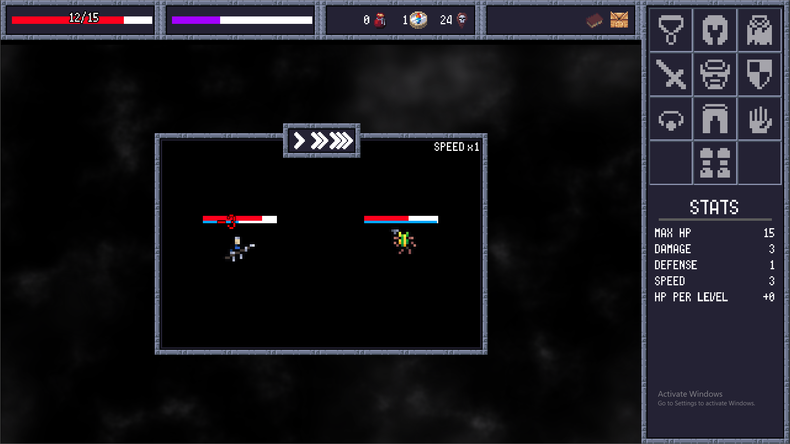
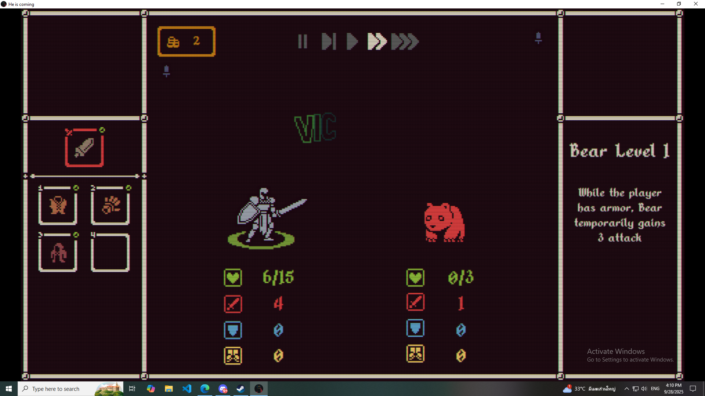
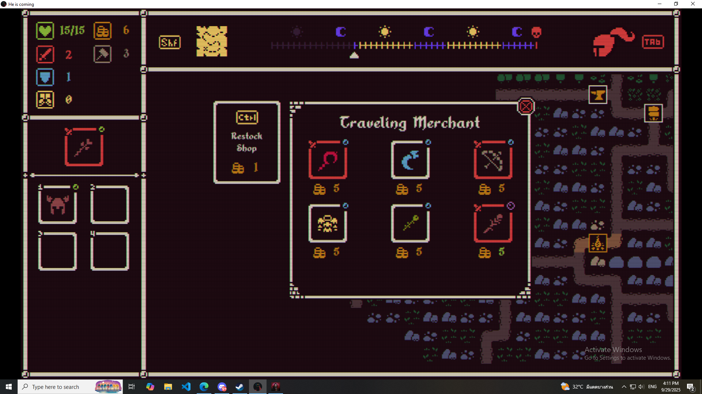
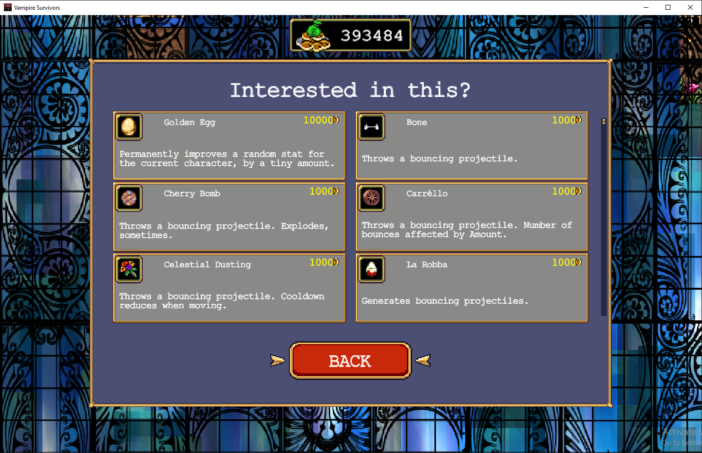
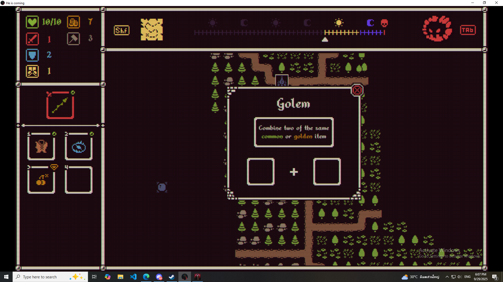
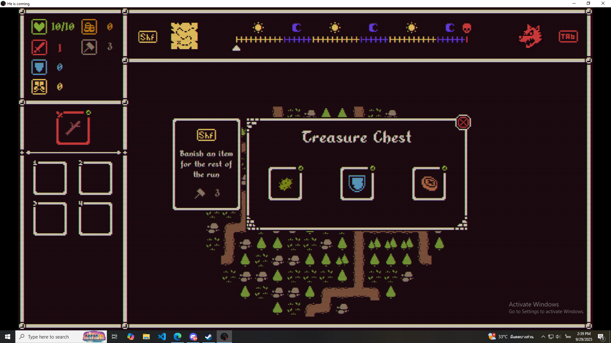
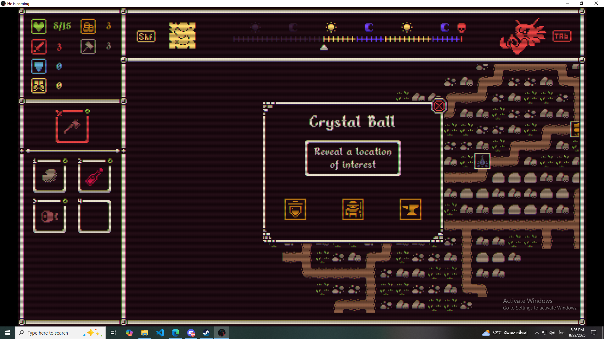

# Sumeeper GDD

# Sumeeper

## Genre :

Open tile Puzzle + auto attack / Strategy / Roguelite / Deckbuilding / RPG

### Game Concept:

Sumeeper เป็นเกมที่ผู้เล่นสามารถออกสำรวจไปใน dungeon ที่เต็มไปด้วยความวัตถุดิบเลิศรส ซึ่งผู้เล่นจะได้รับทเป็นแม่ครัวสาวที่ต้องเข้ามาหาวัตถุดิบบางอย่าง จึงได้เข้ามาใน dungeon แห่งนี้โดยไม่ได้คาดคิดว่าวัตถุดิบเลิศรสเหล่านั้นจะแฝงความอันตรายเอาไว้ด้วย

ซึ่งเป็นการผสมรูปแบบการเล่นของ Minesweeper ที่ต้องวิเคราะห์ความเป็นไปได้ในแต่ละช่อง เข้ากับเกมแนว Roguelite Deckbuilding ที่ผู้เล่นจะต้องวางแผนรูปแบบการเล่นในแต่ละครั้ง และปรับเปลี่ยน build ของผู้เล่นไปตามสิ่งที่ผู้เล่นพบเจอใน dungeon โดยระหว่างทางผู้เล่นจะได้พบศัตรู วัตถุดิบ อาวุธ คำสาป และความสามารถใหม่ๆเพื่อเปิดความเป็นไปได้ใหม่ๆของผู้เล่นในการเล่นแต่ละครั้ง

## Story :

ณ ดันเจี้ยนแห่งหนึ่งที่เมือง Fownteas เมืองที่เป็นส่วนหนึ่งของอาณาจักรโบราณ ในอดีตอาณาจักรนี้คืออารยธรรมที่สูงส่งและก้าวหน้า แต่จากความก้าวหน้านั้นเอง ความเบื่อหนายได้กัดกินจิตใจของผู้คนของพวกเขา นับวันพวกเขายิ่งต้องการประสบการณ์ที่แปลกใหม่ รุนแรง และลึกล้ำมากขึ้นเรื่อยๆ ผู้คนจากเมือง Fownteas เองก็เช่นกัน พวกเขาหลงใหลในงานเลี้ยงและเสพติดความแปลกใหม่ในอาหาร จนวันนึงพวกเขาได้สร้างสถานที่ผลิตอาหารจากคำสาปขึ้นมาเพื่อแสวงหาสิ่งที่พวกเขาต้องการ แต่แล้วงานเลี้ยงของชาว Fownteian ก็ต้องจบลง เมื่อการล่มสลายลงของอาณาจักรโบราณเกิดขึ้น ชาว Fownteian ที่เป็นส่วนนึงของอาณาจักรก็ได้ทำการหลบหนีเข้าไปในสถานที่ผลิตอาหารที่พวกเขาสร้างขึ้น โดยหวังให้พวกตนอยู่รอดโดยอาศัยอาหารจากสถานที่นี้จนถึงตอนที่วิกฤตนี้แผ่นไป แต่กลายเป็นว่าพวกเขาไม่สามารถออกไปจากสถานที่แห่งนี้ได้และค่อยๆกลายเป็นส่วนนึงในสถานที่นี้แทนเป็นผลมาจากคำสาปของพวกเขาเอง

เวลาผ่านไป เหล่าผู้คนมากมายได้ค้นพบเมือง Fownteas อีกครั้งและได้เรียกสถานที่คำสาปในเมืองนี้ว่าดันเจี้ยน ซึ่งเมื่อได้เข้าไปข้างในแล้วเหล่าผู้คนก็ได้ค้นพบสิ่งชีวิตแปลกประหลาดมากมาย เพราะแทบทุกอย่างสามารถนำมาประกอบอาหารได้ ตอนนั้นเองที่กิลนักล่าอาหารได้ถูกตั้งขึ้น โดยมีหน้าที่แสวงหาวัตถุดิบใหม่ๆ รวมถึงจัดหาวัตถุดิบพิเศษจากดันเจี้ยนแห่งนี้ หลังการสำรวจลงเข้าไปลึกขึ้นทางกิลก็ได้พบความอันตรายอีกอย่างของดันเจี้ยนแห่งนี้ นั้นคือคำสาป ซึ่งได้ถูกยืนยันโดยชาว Fownteian ที่ยังหลงเหลืออยู่ในดันเจี้ยน โดยคำสาปของดันเจี้ยนแห่งนี้มีอยู่หลักๆสองอย่างคือ

1. สิ่งมีชีวิตและวัตถุดิบจะค่อยๆเปลี่ยนแปลงเป็นมอนสเตอร์(Feast)
2. มอนสเตอร์(Feast) จะไม่สามารถออกจากดันเจี้ยนนี้ได้

ชาว Fownteian ได้ทำข้อตกลงว่าจะช่วยสนับสนุนกิลนักล่าอาหารในงานการล่าเหล่ามอนสเตอร์(Feast) ของกิลโดยมีข้อแลกเปลี่ยนกับทางกิลต้องนำอาหารจากข้างนอกดันเจี้ยนให้กับพวกเขาได้ลิ้มลอง รวมถึงช่วยจัดการกับ บอสมอนสเตอร์(Special Feast) เพราะภายในดันเจี้ยนแห่งนี้จะมีบอสมอนสเตอร์(Special Feast) ปรากฏตัวขึ้นมาและทำให้มอนสเตอร์ตัวอื่นเกิดก้าวร้าวและเพิ่มจำนวนมากขึ้น ทำให้ชาว Fownteian ใช้ชีวิตอย่างลำบาก ทางกิลจึงได้ประกาศหาผู้คนที่มีความสามารถเพื่อมาเป็นนักล่าอาหารให้กับพวกเขา และส่งเขาเหล่านั้นเข้าสู่ดันเจี้ยน

### Platform :

- Mobile
- PC

### Target Audience :

- กลุ่มคนที่ชอบเล่นเกมที่ใช้ความคิดและการวิเคราะห์ในการเล่นเล็กน้อยไม่ casual เกินไป
- อายุในช่วง 16-44 ปี

### Game Objective :

- กำจัดบอสตัวสุดท้ายของ dungeon ให้ได้
- พัฒนาตัวละครด้วยวิธีต่างๆ เช่น วัตถุดิบ อาวุธ และความสามารถ
- วิเคราะห์และตัดสินใจทางเลือกต่างๆ เช่นการเปิดช่อง การใช้ทรัพยากร เป็นต้น

# Core Mechanics :

## Core gameplay :

ในส่วนนี้จะเป็นสิ่งที่เป็นแก่นของเกม เป็นสิ่งที่ผู้พัฒนาอยากให้ผู้เล่นเก็บเกี่ยวความสนุกจากส่วนนี้เป็นหลัก

การสำรวจด้วยวิธีการแก้ puzzle ผู้เล่นต้องใช้เวลาในการคิดและตัดสินใจได้ว่าตนสามารถเปิดช่องไหนได้บ้าง มีการชั่งน้ำหนักและความต่างในตัวเลือกที่มีว่าจะเลือกทำสิ่งใดก่อนหลัง ผู้เล่นควรรู้สึกลุ้นและแปลกใจในการเปิดช่องแต่ละครั้ง

### Grid(ช่อง):

ภายในเกมนี้ map จะมีลักษณะเป็นช่องตาราง โดยเมื่อเริ่มเกมแต่ละช่องจะถูกปิดอยู่ เมื่อช่องถูกเปิดจะแสดงสิ่งที่อยู่ภายใต้ช่องนั้นโดยจะตอบกลับผู้เล่นมาในรูปแบบของ encounter หากเป็นช่องที่ไม่มีอะไรก็จะไม่มี encounter เกิดขึ้น

โดยช่องที่ถูกเปิดจะแสดงตัวเลขออกมาหากรอบตัวมันมีมอนเตอร์ หรือ trap อยู่

ตัวเลขที่แสดงออกมาจะบอกถึงผลรวมของระดับมอนเตอร์ โดยรอบ ตามด้วยเลขของจำนวน trap ที่อยู่โดยรอบ

โดย trap จะแสดงเป็นเลขหลังตัว "/"

ตัวอย่าง

| Trap | /1 |  |
| --- | --- | --- |
| 2/1 | 3/1 | 3 |
| 2 | Tier 2 | Tier 1 |

### Stat(ค่าพลัง):

ค่าพลังต่างๆ ของผู้เล่น

1. ค่าพลังชีวิต(HP) : ค่าพลังชีวิตหากหมดจะเป็นการแพ้
2. ค่าพลังงาน(STA) : ค่าที่เอาไว้ใช้ในการปักธง และหลบหนี
3. ค่าป้องกัน(DEF) : ค่าที่ช่วยรับความเสียหายก่อน HP จะได้รับความเสียหาย
4. ค่าความเร็ว(SPD) : ค่าที่เป็นตัวกำหนดความเร็วในการโจมตี และใช้คำนวนในการหลบหนี
5. ค่าพลังโจมตี(ATK) : ค่าความเสียหายที่จะทำได้เมื่อทำการโจมตี

ค่าประสบการณ์(EXP) : ค่าประสบการณ์ของผู้เล่นใช้กำหนด rarity ของสิ่งต่างๆ การเปิดช่องแผนที่ / กำจัดมอนสเตอร์

# Encounter:

encounter ภายในเกมนี้มีหลายรูปแบบได้แก่

## Combat Encounter:

จะเกิดขึ้นเมื่อทำการเปิดช่องที่มีมอนสเตอร์(Feast) หน้าการต่อสู้(Combat) จะประกอบไปด้วย

- ค่าพลังงาน(STA) : เป็น slide bar แบบเป็นช่องแบบ Combat01-B
- มีบอกถึงค่าพลังที่ใช้ในการ combat ของทั้งเราและมอนเตอร์ ได้แก่
    - ค่าพลังชีวิต(HP) : เป็น slide bar ซึ่งบอกถึงค่าพลังชีวิตที่มีอยู่ คล้ายภาพ Combat01
    - ค่าพลังโจมตี(ATK) : เป็นตัวเลขบอกถึงค่าพลังโจมตีที่มีอยู่ คล้ายภาพ Combat02
    - ค่าป้องกัน(DEF) : เป็นตัวเลขบอกถึงค่าป้องกันที่มีอยู่คล้ายภาพ Combat02
    - ค่าความเร็ว(SPD) : เป็น slide bar ซึ่งบอกถึงค่าความเร็วที่มีอยู่คล้ายภาพ Combat02
    - หลอดการโจมตี(Action Gauge) : เป็น slide bar แบบเป็นช่อง ซึ่งบอกถึงเวลาที่ออกท่าพิเศษจะเกิดขึ้น ทำงานคล้ายภาพ Combat01-B แต่มีการแบ่งช่องแบบ Combat01-B
    - หลอดความเร็ว(Speed Gauge) : เป็น slide bar ซึ่งค่าภายในจะเพิ่มขึ้นเรื่อยๆ สอดคล้องกับความเร็วของผู้เล่นทำงานแบบภาพ Combat01-B
- มีปุ่มที่ผู้เล่นสามารถกดเพื่อจัดการการ Pre-Combat ได้แก่
    - retreat : เมื่อกดจะเป็นการหลบหนีจากศัตรู
    - auto battle : เมื่อกดจะเป็นการเริ่มการต่อสู้ หากการต่อสู้ดำเนิดอยู่การกดปุ่มนี้จะทำให้ความเร็วในการต่อสู้เป็นปกติ
    - auto battle*2 : เมื่อกดจะเป็นการเริ่มการต่อสู้ หากการต่อสู้ดำเนิดอยู่การกดปุ่มนี้จะทำให้ความเร็วในการต่อสู้เป็นแบบเร็วกว่าปกติสองเท่า
    - auto battle*4 : เมื่อกดจะเป็นการเริ่มการต่อสู้ หากการต่อสู้ดำเนิดอยู่การกดปุ่มนี้จะทำให้ความเร็วในการต่อสู้เป็นแบบเร็วกว่าปกติสี่เท่า
    - skip battle : เมื่อกดจะเป็นการข้ามการต่อสู้นี้ไปแล้วเข้าสู้บทสรุปของการต่อสู้เลย
- มีปุ่มที่ผู้เล่นสามารถกดเพื่อจัดการการ Pre-Combat ได้แก่
- มีส่วนที่เอาไว้บอกอุปกรณ์สวมใส่ของผู้เล่น
- มีส่วนที่เอาไว้บอกความสามารถของมอนเตอร์
- Ref :

> 
> 
> 
> **ภาพ Combat01-A**
> 
> 
> 
> **ภาพ Combat01-B**
> 
> 
> 

ภาพ Combat02

## Shop encounter :

จะเกิดขึ้นเมื่อทำการเปิดช่องที่มีพ่อค้า(Merchef) ใช้สำหรับการซื้ออุปกรณ์ และอาหาร (ซื้อแล้วจะกินเลย)

หน้าพ่อค้า(Merchef) ประกอบไปด้วย

- มีช่องของ 6 ช่องให้ผู้เล่นเลือกซื้อ
- มีปุ่มสำหรับการ reroll ซึ่งเมื่อกดจะสุ่มของทั้งหมดในหน้าร้านค้าใหม่
- มีปุ่มยกเลิก (Cancel) เพื่อออกจากหน้าร้านค้า
- Ref

## Forge encounter :

จะเกิดขึ้นเมื่อทำการเปิดช่องที่มีช่างทำครัว(Kitchen Smith) ใช้สำหรับการรวมอุปกรณ์ของผู้เล่นที่ชนิดเดียวกัน ให้ระดับเพิ่มขึ้นหนึ่งระดับคล้ายการ marge เพื่อให้ equipment ระดับต่ำยังสามารถใช้งานได้อยู่ หน้าช่างทำครัว(Kitchen Smith) ประกอบไปด้วย

- มีช่องว่างสองช่อง สำหรับใส่อุปกรณ์
    - กดที่อุปกรณ์ในช่องอุปกรณ์สวมใส่ (equipment) จะเป็นการเลือกอุปกรณ์นั้นเข้ามาที่ช่องว่างของหน้าเสริมแกร่งเครื่องครัว
    - กดที่อุปกรณ์ในช่องว่างอีกครั้ง เพื่อเอาออกจากช่องว่าง
- มีปุ่มยกเลิก(Cancel) เพื่อออกจากหน้าเสริมแกร่งเครื่องครัว
- Ref
- เช่น
    - X LV.1 + X LV. 1 = X LV.2
    - ตะหลิว LV.1 + ตะหลิว LV. 1 = ตะหลิว LV.2
        
        
        

## Perk encounter :

จะเกิดขึ้นเมื่อทำการเปิดช่องที่มีผู้ปรุงรส(The Seasoned One)

- มี perk สุ่มออกมาให้ผู้เล่นเลือกสามอัน
- มีปุ่มสำหรับการ reroll ของ perk แต่ละอัน ซึ่งเมื่อกดจะเป็นการสุ่ม perk นั้นๆ
- Ref

## Item encounter :

จะเกิดขึ้นเมื่อผู้เล่นกดช่องที่มีกล่องสมบัติ(Chest) จะมีหน้าเลือก item แสดงขึ้นมา

- มีอุปกรณ์สวมใส่สุ่มมาให้ผู้เล่นเลือกสามอัน
- มีปุ่มสำหรับการนำอาวุธที่เลือกไปออกจากการเล่นรอบนี้ (Banish) โดยเมื่อกดจะเป็นการเข้าสู้หน้า Banish โดยในหน้าตอนนี้การกดที่ item ของผู้เล่นจะเป็นการ Banish แทน
    - ซึ่งจะมีปุ่มยกเลิก(Cancel) ขึ้นมาในหน้านี้ เพื่อออกจากหน้า Banish
- Ref

> 
> 
> 
> 
> 

## Hint encounter :

จะเกิดขึ้นเมื่อทำการเปิดช่องที่มีผู้นำทาง(Flavour Prophet) สามารถช่วยผู้เล่นในการเปิดเผยตำแหน่งของ encounter ประเภทที่ผู้เล่นเลือกได้

หน้าเปิดเผยตำแหน่ง (Reveal the location) ประกอบไปด้วย

- มีภาพ icon ของ encounter ที่มีอยู่ใน map สามอัน เช่น Shop encounter, Forge encounter, Perk encounter แล้วให้ผู้เล่นเลือกหากเลือกอันไหนจะทำการโชว์เงาช่องที่มี encounter นั้น หนึ่งช่องเพื่อเป็นการบอกใบ้ผู้เล่นว่า encounter ที่เลือกนั้นอยู่ตรงไหน หาก encounter พิเศษในแมพมีไม่พอที่จะแสดงสามอันจะมีการใส่ช่องที่ปลอดภัยใส่เข้าไปในตัวเลือกแทน หาก encounter พิเศษและช่องที่ปลอดภัยไม่มีอยู่แล้วใน map หากกดพบ Hint encounter จะให้เป็นเงินกับผู้เล่นแทน
- Ref

# Combat(การต่อสู้) :

## Combat State :

หน้า Combat encounter จะแบ่งเป็นสอง state ย่อย

1. state ก่อนเริ่มการต่อสู้
    1. ผู้เล่นจะสามารถเลือกได้ว่าจะเริ่มการต่อสู้ auto battle หรือถอย retreat ใน state นี้
    2. state นี้จะมีหลอด STA แสดงเพื่อบอกว่าตอนนี้ผู้เล่นมี STA เหลืออยู่เท่าไหร่
    3. retreat จะเป็นการที่ผู้เล่นใช้ค่า STA ในการหนี
        - STA ที่จะต้องใช้ในการ retreat เท่ากับ tier ของ monster
        - ถ้าหากผู้เล่นมี STA ที่ต้องใช้ไม่พอ ก็จะไม่สามารถ retreat ได้
    4. auto battle เริ่มการต่อสู้และเป็นการออกจากช่วงนี้
2. state การต่อสู้
    1. auto battle จะเริ่มการ auto battle ซึ่งจะดำเนินต่อไปจนกว่า auto battle จะจบลง
        - สามารถเริ่มการต่อสู้ได้จากการกด *2 หรือ *4 ก็ได้โดยความเร็วในการต่อสู้ก็จะเป็นไปตามปุ่มที่กดเริ่ม
        - หากเริ่มการต่อสู้แล้ว สามารถกดเปลี่ยนความเร็วของการต่อสู้ได้จาก *1, *2, *4
        - หากเริ่มการต่อสู้แล้ว สามารถกดปุ่ม skip battle ได้
        - หากเริ่มการต่อสู้แล้ว จะไม่สามารถกด retreat ได้
    2. retreat ใน state นี้ก็ยังสามารถกด retreat ได้และใช้หลักการเดียวกับแบบหน้าก่อนเริ่มการต่อสู้
    3. state นี้จะจบลงเมื่อมีฝ่ายใดฝ่ายนึงพลังชีวิต(HP) ต่ำกว่าหรือเท่ากับศูนย์

## Auto battle :

> หลักการของ Gauge
> 

### Action Gauge (หลอดการออกท่าพิเศษ) :

- หมายถึง
- Gauge นี้จะถูกแบ่งเป็นช่อง โดยปกติจะมี 2 ช่อง ซึ่งสามารถเปลี่ยนแปลงได้โดยอิงจากตัวละคร และอุปกรณ์ที่สวมใส่
- Gauge นี้จะเพิ่มทีละเป็นช่อง
- เมื่อทุกช่องใน Gauge นี้เต็มการโจมตีครั้งไปจะทำความเสียหาย บวกด้วยจำนวน action gauge
- เมื่อเต็มแล้ว Gauge จะรีเซ็ตให้ทุกช่องกลับมาว่าง

### Speed Gauge (หลอดความเร็ว)

- Value ของ Gauge นี้จะเพิ่มเรื่อยๆ โดยสัมพันธ์กับค่าความเร็ว(SPD)
- เมื่อ Gauge นี้เต็มจะทำการเพิ่มช่องให้ของ Action Gauge หนึ่งช่องและโจมตีหนึ่งครั้ง
- เมื่อเต็มแล้ว Gauge จะรีเซ็ตให้ value มาเริ่มที่ 0 ใหม่

### Damage Calculate (การคำนวนความเสียหาย)

ใช้การหักลบแบบปกติคือ ความเสียหาย(Damage) = เกิดจากพลังโจมตี(ATK) - ค่าพลังป้องกัน(DEF) ความเสียหายที่ได้นี้คือค่าที่จะเข้าพลังชีวิต(HP) ของอีกฝ่าย

Feature :

ในส่วนนี้เป็นองค์ประกอบต่างๆ ที่มีภายในเกม มีไว้เพื่อส่งเสริม Core gameplay หรือทำให้ Core gameplay กลมกลอมมากขึ้น

# Feast (มอนสเตอร์):

มอนสเตอร์ภายในเกมนี้จะถูกเรียกว่า Feast(beast+food) โดยเหล่า Feast นั้นจะถูกแบ่งออกเป็น 5 ระดับซึ่งในแต่ละระดับจะมีค่าพลังและความสามารถที่ต่างกัน

- ระดับที่ 1 : มี Stat อยู่ในระดับต่ำมาก อาจมีหรือไม่มี Ability ก็ได้
- ระดับที่ 2 : มี Stat อยู่ในระดับต่ำ มี Ability อย่างน้อยหนึ่ง Ability
- ระดับที่ 3 : มี Stat อยู่ในระดับปานกลาง มี Ability อย่างน้อยหนึ่ง Ability
- ระดับที่ 4 : มี Stat อยู่ในระดับสูง มี Ability อย่างน้อยสอง Ability
- ระดับที่ 5 : ในระดับนี้จะถูกเรียกว่าบอส มี Stat อยู่ในระดับสูงมาก มี Ability อย่างน้อยสอง Ability

## Ability (ความสามารถ):

### Ability type:

ประเภทการทำงานของความสามารถแบ่งออกได้เป็น

- Passive Ability (ทำงานในทั้ง explore stat และ combat state)
    - Passive : ทำงานตลอดเวลาเมื่อเจ้าของ Ability ยังปรากฏตัว
- Grid Ability (ทำงานใน explore state)
    - **Battlecry :** ทำงานเมื่อเจ้าของ Ability ปรากฏตัว
    - **Stealth :** ทำงานเมื่อเจ้าของ Ability ปรากฏตัวโดยไม่โดนปักธงเอาไว้
    - **Death :** ทำงานเมื่อเจ้าของ Ability ตาย
- Combat Ability(ทำงานใน combat state)
    - **On-Start :** ทำงานเมื่อเจ้าของ Ability เข้าร่วมการต่อสู้(เกิดขึ้นครั้งเดียว)
    - **On-Hit :** ทำงานเมื่อเจ้าของ Ability ทำการโจมตี
    - **On-Damaged :** ทำงานเมื่อเจ้าของ Ability ได้รับความเสียหาย
    - **On-Half :** ทำงานเมื่อเจ้าของ Ability พลังชีวิตต่ำกว่าครึ่งหนึ่งเป็นครั้งแรกในการต่อสู้
    - **On-Exposed** : ทำงานเมื่อเจ้าของ Ability มีค่า DEF เหลือ 0 ครั้งแรก
    - **On-Full** : ทำงานเมื่อเจ้าของ Ability มีค่า HP เท่ากับ max HP
    - **On-Action** : ทำงานเมื่อเจ้าของ Ability นั้น Action และ Speed Gauge เต็มพร้อมกัน

## Keyword:

### Intensity (ระดับความรุนแรง) :

ค่าที่บอกถึงระดับความเข้มข้นของ keyword นั้น ยิ่งมาก keyword ก็จะส่งผลมาก จะถูกใช้ใน Combat Keyword

### Range(ระยะของความสามารถ) :

ค่าที่บอกถึงระยะที่ keyword นั้นจะส่งผล เป็นช่องรอบตัวของของเจ้าของ Ability จะถูกใช้ใน Grid Keyword

ประเภทของ keyword แบ่งได้เป็น

- Grid Keyword (ทำงานได้กับ Grid Ability เท่านั้น และไม่มี Intensity)
    - **Freezer** : เมื่อทำงานเจ้าของ keyword จะทำการแช่แข็งช่องที่ปิดอยู่รอบตัว ทำให้ผู้เล่นไม่สามารถเปิดช่องในระยะ range ของเจ้าของ keyword นี้ได้ และช่องที่ถูก Freeze จะกลับมาเปิดได้เมื่อผู้เล่นผ่านการต่อสู้ไป 3 ครั้ง
    - **Taunt** : เมื่อทำงานเจ้าของ keyword จะทำการยั่วยุผู้เล่นทำให้ผู้เล่นไม่สามารถโจมตีมอนสเตอร์อื่นที่เปิดอยู่ได้นอกจากมอนสเตอร์ที่มี taunt ใน range ที่กำหนด (ถ้ามอนสเตอร์มี taunt เหมือนกัน จะตีตัวไหนก็ได้)
- Combat Keyword(ทำงานได้กับ Grid Ability เท่านั้นและไม่มี Range)
    - **Gain** : เมื่อทำงานเจ้าของ keyword จะได้รับค่า Stat หรือ Keyword ที่กำหนดตามระดับ intensity ผลนี้จะหายไปเมื่อจบ combat
    - **Lose** : เมื่อทำงานเจ้าของ keyword จะเสียค่า Stat หรือ Keyword ที่กำหนดตามระดับ intensity ผลนี้จะหายไปเมื่อจบ combat
    - **Convert** : เมื่อทำงานเจ้าของ keyword จะสลับค่า Stat ที่กำหนดตามระดับ intensity ผลนี้จะหายไปเมื่อจบ combat
    - **Restore** : เมื่อทำงานเจ้าของ keyword จะได้รับการฟื้นฟูพลังชีวิตตามระดับ intensity
    - **Eater** : เมื่อทำงานเจ้าของ keyword จะสุ่มกินวัตถุดิบของผู้เล่นจำนวนตามระดับ intensity
    - **Armor** : เมื่อทำงานเจ้าของ keyword จะได้รับ stack ของ Armor ตามระดับ intensity ซึ่งจะได้รับความเสียหายลดลงตามระดับ intensity แต่จะไม่ลดลงต่ำกว่า 1 หน่วย และผลนี้จะหายไปเมื่อจบ combat
    - **Thorn** : เมื่อทำงานเจ้าของ keyword จะได้รับ stack ของ thorn ตามระดับ intensity และเมื่อศัตรูโจมตีจะทำความเสียหายให้แก่ศัตรูตาม stack ของ thorn ที่เจ้าของ keyword มีอยู่ และผลนี้จะหายไปเมื่อจบ combat
    - **Fury** : เมื่อทำงานเจ้าของ keyword จะได้รับ stack ของ Fury ซึ่งจะโจมตีเสริมอีกหนึ่งครั้งต่อหนึ่งการโจมตี จำนวนครั้งที่โจมตีเสริมจะเพิ่มตามระดับ intensity และผลนี้จะหายไปเมื่อจบ combat

# Level (เลเวล)

เลเวลจะเป็นตัวกำหนดค่าพลังพื้นฐานของผู้เล่น และมอนสเตอร์ โดยอิงตาม [player level](https://docs.google.com/spreadsheets/d/1sss3-5o_RKYdAQY2NT6FHwRViqSy6LY3Ff0Gw1HhIgk/edit?usp=sharing)

- Player Level : ผู้เล่นจะได้รับเลเวลเพิ่มขึ้นเมื่อเก็บ exp ถึงเกณฑ์ที่กำหนด
    - ผู้เล่นจะได้รับ exp จากการเปิดช่องสำรวจ
    - กำจัดมอนสเตอร์
    - ...
- Feast Level : มอนสเตอร์จะเลเวลมากขึ้นตามชั้นที่ผู้เล่นอยู่โดยอิงตาม [feast level](https://docs.google.com/spreadsheets/d/1sss3-5o_RKYdAQY2NT6FHwRViqSy6LY3Ff0Gw1HhIgk/edit?usp=sharing)

# Cook(ทำอาหาร)

การทำอาหารคือการนำวัตถุดิบที่ผู้เล่นมีมาใช้งานใน "หน้าทำอาหาร" หากจากนั้นผู้เล่นจะได้รับ meal ซึ่งสามารถนำมาผสมกันได้หลายรูปแบบเพื่อให้ได้ meal ที่แตกต่างกันออกไป

Cook Popup(หน้าทำอาหาร) ประกอบไปด้วย

- จำนวนวัตถุดิบที่ผู้เล่นมีในแต่ละแบบ
- Recipe(สูตรอาหาร) ส่วนที่ใช้แสดงสูตรอาหารที่ผู้เล่นนั้นเตรียมมา
- ปุ่ม cook(ทำอาหาร) ใช้สำหรับยืนยันการทำอาหาร
- ช่องสำหรับแสดงอาหารที่ผู้เล่นจะได้รับหากทำอาหารเสร็จ

Meal(อาหาร) :

อาหารคือไอเทมที่ให้ผลชั่วคราวในการต่อสู้แต่ละครั้ง อาหารสามารถได้รับจากการทำอาหาร และซื้อจาก shop encounter เมื่อถูกใช้งานจะให้ผลแตกต่างกันไปตามประเภทของอาหาร ดังนี้

- การฟื้นฟู อาหารเป็นวิธีหลักในการฟื้นฟู HP และ STA ให้กับผู้เล่น
- ความสามารถในการ buff ผู้เล่น โดยระยะเวลาของการ buff จะลดลงตาม Encounter ที่ผู้เล่นพบ

Ingredients(วัตถุดิบ) :

วัตถุดิบมีสามแบบได้แก่

- **Meat(เนื้อ)**
- **Vegie(ผัก)**
- **Spices(เครื่องเทศ)**

ซึ่งวัตถุดิบเหล่านี้จะได้รับจากปราบมอนสเตอร์

- **Item encounter**

Recipe(สูตรอาหาร):

สูตรอาหารจะขึ้นอยู่กับความเป็นไปได้ของการผสมวัตถุดิบตั้งแต่สองชิ้นขึ้นไป โดยมีแสดงออกมาดังนี้

ตั้งให้ m : Meat, v : Vegie, s : Spices

แบบ 2 ชิ้น

- mm
- mv
- ms
- vv
- vs
- ss

แบบ 3 ชิ้น

- mmm
- mmv
- mms
- mvv
- mvs
- mss
- vvv
- vvs
- vss
- sss

ความสามารถของอาหารตามใน [[Sumeeper_Meal_Sheet - Google Sheets](https://docs.google.com/spreadsheets/d/1sdAgOIGNGCfxWpZqtK6lbD7q5QCI75FhXPk7tm2NbSE/edit?gid=873840665#gid=873840665)](https://app.notion.com/p/3a1851e98c4680668b54dcd610cd1666?pvs=21) 

# Equipment(อุปกรณ์):

อุปกรณ์เป็นหัวใจของการสร้าง "Build(สายการเล่น)" ของผู้เล่นใน run นั้นๆ โดยส่วนมากจะเป็นการเสริมค่าพลังให้กับผู้เล่น รวมถึงทำให้ผู้เล่นมี Ability(ความสามารถ) ขณะสวมใส่อยู่อีกด้วย สามารถใส่ได้สูงสุด 6 ช่อง

## Equipment Tier(ระดับของอุปกรณ์):

ระดับของอุปกรณ์ถูกแบ่งออกเป็น 5 ระดับ ซึ่งในแต่ละระดับจะเสริมพลังและให้ความสามารถที่มากขึ้นตามลำดับ และยิ่งระดับสูงยิ่งมีความเฉพาะและสำคัญมากขึ้นในแต่ละ Build

## Equipment Set(ชุดอุปกรณ์)

อุปกรณ์หากผู้เล่นสวมใส่ร่วมกันจะมอบความสามารถเพิ่มเติมให้แก่ผู้เล่น

ความสามารถของอุปกรณ์ และชุดอุปกรณ์ ตามใน [[Sumeeper_Equipment_Sheet - Google Sheets](https://docs.google.com/spreadsheets/d/1rUPio8LanbJS5ZShKaQTgIOmCiUVkfYStu5xBRRVfhc/edit?gid=1391269013#gid=1391269013)](https://app.notion.com/p/3a1851e98c4680219627feae7587da22?pvs=21) 

# Perk (สิทธิพิเศษ)

Perk เป็นการปรับเปลี่ยนหรือเพิ่มความสามารถให้กับผู้เล่นใน run นั้นๆ ส่งผลไปยังชั้นถัดไปด้วย โดยได้รับจาก Perk Encounter เมื่อได้รับแล้ว perk จะส่งผลทันทีซึ่งจะแสดงออกมาคล้าย passive skill ตัว perk เหล่านี้สามารถกำหนดทิศทางการสร้าง build ของผู้เล่นได้

โดย perk แบ่งเป็นสามประเภทคือ

- Primary : เป็น perk ที่จะเปลี่ยนรูปแบบการต่อสู้ของผู้เล่นไปเลยจะออกมาให้ผู้เล่นเลือกได้ครั้งเดียว หากผู้เล่นเลือก primary แล้วไม่ออกมาอีก
- Secondary : เป็น perk ที่จะออกมาหลังจากที่ผู้เล่นได้เลือก primary ไปแล้วโดยจะเป็นเหมือนส่วนเสริมให้กับ primary ที่เลือกมา
- Normal : เป็น perk ที่สามารถออกมาได้ตลอดไม่ว่าจะเลือก primary อะไร

ความสามารถของสิทธิพิเศษตามใน [[Sumeeper_Perk_Sheet - Google Sheets](https://docs.google.com/spreadsheets/d/1YcW5csmRjM_shf_0aQx8yJ6c4EI9b3bo5_6MXb_VzY0/edit?gid=491311923#gid=491311923)](https://app.notion.com/p/3a1851e98c4680b296acfa26f00da0f3?pvs=21) 

# Curse (คำสาป)

Curse เป็นผลเสียที่จะส่งผลต่อผู้เล่น โดยเกิดจากการลงไปในชั้นที่ลึกขึ้น จุดประสงค์ของระบบนี้คือเพิ่มความตึงเครียดให้กับ run และผลักดันให้ผู้เล่นต้องปรับกลยุทธ์ใหม่ และเป็นตัวเพิ่มความยากในการเล่นสำหรับ progress ถัดๆไปของผู้เล่น โดยสุ่มโดนเมื่อลงไปชั้นใหม่

ความสามารถของคำสาปตามใน [[Sumeeper_Curse_Sheet - Google Sheets](https://docs.google.com/spreadsheets/d/1YGUmuf7Wm0uAwDU-yCrMqquW_KWLavyRrJpZ7SztGVk/edit?gid=1372917316#gid=1372917316)](https://app.notion.com/p/3a1851e98c4680539572c9bf4a780bf0?pvs=21) 

# Core gameloop :

ในส่วนนี้จะเป็นสิ่งที่มาครอบตัว core gameplay เอาไว้เพื่อให้ผู้เล่นทำการเล่นต่อไปเรื่อยๆ ซึ่งเกมนี้จะใช้การปลดล็อค equipment, character, Recipe ใหม่ๆ ในแต่ละ progression ของผู้เล่น ซึ่งจะถูกกำหนดโดยเงื่อนไขการปลดล็อค จำนวนเงินที่ต้องใช้ จำนวนครั้งที่ผู้เล่นเครียร์บอส

## Run:

หนึ่งรอบการเล่นภายในเกมนี้หมายถึง การที่ผู้เล่นรับคำเรียกร้องจากทางกิลนักล่าอาหาร เข้าสู้ดันเจี้ยนเพื่อค้นหาวัตถุดิบ และหลังจากได้บทสรุปของการหาวัตถุดิบในครั้งนั้นแล้วจะถือว่าเป็นการจบหนึ่ง run

## Currency:

สิ่งที่ใช้เป็น currency ภายในเกมนี้ประกอบไปด้วย

### Coin :

> เป็นสกุลเงินที่ใช้ภายนอกดันเจี้ยน ถูกใช้เพื่อ
> 
- ปลดล็อค equipment
- ปลดล็อค character

### Fath :

> เป็นสกุลเงินที่ใช้ภายในดันเจี้ยน ได้มาจากมอนสเตอร์ ถูกใช้เพื่อ
> 
- ซื้อ equipment ภายใน run นั้น
- การ reroll หน้า encounter ต่างๆ

### Special Ingredients :

### เป็นวัตถุดิบพิเศษที่ได้รับจากการปราบบอสในดันเจี้ยน ถูกใช้เพื่อ

- ใช้ในการส่ง quest
- ปลดล็อค character
- ปลดล็อค recipe

## Quest (คำเรียกร้อง):

คำเรียกร้องจะขอวัตถุดิบสามอย่างที่สามารถได้รับจากบอสทั้งสามตัวที่ปรากฏใน run นั้นๆ หมายความว่าบอสที่ผู้เล่นจะได้พบในแต่ละ run จะถูกกำหนดไว้แล้วจากคำเรียกร้องวัตถุดิบอยู่แล้ว ทำให้ผู้เล่นสามารถวางแผนรวมถึงคิดวิธีรับมือกับบอสได้

## Reward (รางวัล):

- รางวัลที่ผู้เล่นจะได้รับในแต่ละ run จะขึ้นอยู่กับ
    - จำนวนวัตถุดิบพิเศษในคำเรียกร้อง
        - ไม่ได้รับวัตถุดิบพิเศษเลย : ไม่ได้รับ coin
        - ได้วัตถุดิบพิเศษหนึ่งชิ้น : ได้รับ 100 coin
        - ได้วัตถุดิบพิเศษสองชิ้น : ได้รับ 300 coin
        - ได้วัตถุดิบพิเศษครบสามชิ้น : ได้รับ 500 coin และถือว่าส่งคำเรียกร้องสำเร็จ
    - จำนวนวัตถุดิบที่เหลือหลังจากออกจากดันเจี้ยน โดยจะได้รับ xx coin ตามจำนวนวัตถุดิบที่เหลือ
    - จำนวน fath ที่เหลือหลังจากออกจากดันเจี้ยน โดยจะได้รับ xx coin ตามสัดส่วน 1 fath ต่อ 10 coin
- รางวัลที่ผู้เล่นจะได้รับหลังจากส่งคำเรียกร้องสำเร็จ
    - ปลดล็อค Recipe ใหม่
    - ปลดล็อคมอนเตอร์ใหม่
    - ถือว่าเป็นการ progression หลักของเกม จะมี equipment, character บางตัวที่จะอนุญาติให้ปลดล็อคได้หลังจากสำเร็จคำเรียกร้องถึงจำนวนที่กำหนด

## The Curse Contract (สัญญาคำสาป)

สัญญาคำสาปคือระบบในการปรับแต่งระดับความยากภายในดันเจี้ยน โดยผู้เล่นสามารถปรับแต่งได้ตาม [[Sumeeper_Curse_Sheet - Google Sheets](https://docs.google.com/spreadsheets/d/1YGUmuf7Wm0uAwDU-yCrMqquW_KWLavyRrJpZ7SztGVk/edit?gid=1372917316#gid=1372917316)](https://app.notion.com/p/3a1851e98c4680539572c9bf4a780bf0?pvs=21) 

และ curse เหล่านี้ผู้เล่นจะได้รับในทุกครั้งที่ลงไปในชั้นที่เยอะขึ้นชั้นละหนึ่ง curse

## Threat

ค่าที่บ่งบอกความยากรวมจากทุกเงื่อนไขที่ผู้เล่นได้ปรับแต่งไปใน run นั้นๆ ซึ่งค่า threat นี้จะส่งผลต่อรางวัลของผู้เล่น โดยผู้เล่นจะไม่สามารถได้รับวัตถุดิบพิเศษซ้ำจากบอสตัวเดิมใน threat เท่าเดิมได้ ทำให้ผู้เล่นต้องเพิ่มค่า Threat ในแต่ละ run เพื่อให้ได้รับวัตถุดิบพิเศษเวลากำจัดบอสอยู่

# Character :

> ในแต่ละตัวละครจะมีการเติบโตภายใน run นั้นตามเลเวลตามใน [Character data](https://docs.google.com/spreadsheets/d/1sss3-5o_RKYdAQY2NT6FHwRViqSy6LY3Ff0Gw1HhIgk/edit?gid=2108891595#gid=2108891595) รวมถึงมีความสามารถเฉพาะตัวที่เรียกว่าสกิล วิธีใช้งานจะคล้ายกับการกดธงในเกม mine sweeper แต่จะเรียบง่ายและส่งผลทันที เรียกว่าสกิลธง โดยมีรายละเอียดตามใน [Character data](https://docs.google.com/spreadsheets/d/1sss3-5o_RKYdAQY2NT6FHwRViqSy6LY3Ff0Gw1HhIgk/edit?gid=2108891595#gid=2108891595) เช่นกัน
> 

# Floor Variant :

### Myceland

#### ที่มาของ Feast

ชาว Fownteian ใช้พื้นที่ส่วนนี้เป็นห้องเพาะเห็ดขนาดยักษ์ใต้ดิน ความมืดและความชื้นทำให้ Feast สายพันธุ์หายากเกิดขึ้น โดยเกิดจากเห็ด (mycelium) แทรกซึมอยู่ในทุกรอยแยกของพื้นหิน

เมื่อคำสาปแผ่ลงมา เส้นใยที่ฝังรากลึกเหล่านั้นดูดซับพลังงานคำสาปก่อนใคร และกลายเป็นเครือข่ายที่มีสำนึก สิ่งมีชีวิตที่อาศัยอยู่ในบริเวณนี้ — หนู แมลง แม้แต่พืชเล็กๆ — ถูกเส้นใยที่แผ่ออกมาเกาะติดและหลอมรวมเข้ากับโครงสร้างของเห็ด จนกลายเป็น Feast ที่มีความเกี่ยวข้องกับเห็ด

สปอร์ที่พวกมันปล่อยออกมาสำหรับการสืบพันธุ์นั้นติดพลังคำสาปมาด้วย — ทำให้ในชั้นนี้มีละอองคำสาปล่องลอยอยู่ในอากาศตลอดเวลา ส่งผลให้การมองเห็นคลาดเคลื่อนไปจากความเป็นจริง

#### ภาพลักษณ์ของชั้น

ไม่มีแสงแดดส่องลงมาถึงที่นี่ แต่ก็ไม่มืดสนิท อากาศที่นี่หนักและอบอ้าว มีกลิ่นคล้ายดินหรือไม้ชื้นๆ เข้ามาจมูกทุกครั้งที่หายใจ

ทุกก้าวที่ย่างลึกลงไปใน Myceland จะพบกับแสงสีม่วงและน้ำเงินจางๆ ที่เรืองรองอยู่จากเส้นใยบนเพดานหิน เห็ดขนาดยักษ์ ตั้งตระหง่านเรียงรายจนบดบังทิศทาง มีเส้นใยของเห็ดเหล่านี้แทรกซึมไปตามพื้นดิน หยากไย่ของมันเชื่อมกันเป็นตาข่ายแผ่ไปทั่วพื้นดิน

### Sugar Garden

#### ที่มาของ Feast

ชาว Fownteian หลงใหลในความหวานเป็นพิเศษ พวกเขาได้ใช้คำสาปทำให้พื้นดินในชั้นนี้ดูดซับความหวานจากสิ่งต่างๆ เอาไว้ กลายเป็นพื้นที่เหมือนผลึกน้ำตาลขนาดใหญ่

พลังงานความหวานและคำสาปที่อัดแน่นในพื้นน้ำตาลเหล่านั้นได้สร้าง Feast ที่มีลักษณะเหมือนขนม — สีสันสดใส รูปร่างน่ารัก — แต่ซ่อนความโหดร้ายไว้ภายใน

ยิ่ง Feast ขนมเหล่านี้ที่ดูน่ากินมากเท่าไหร่ ก็ยิ่งอันตรายมากเท่านั้น นักล่าหลายคนพลาดท่าเพราะเชื่อในรูปลักษณ์ภายนอก

#### ภาพลักษณ์ของชั้น

ผนังที่นี่ทำจากน้ำตาลผลึกหนาหลายนิ้ว ความหนาวเย็นที่กัดกินชั้นนี้ทำให้มีหิมะตกอยู่ตลอดเวลา ซึ่งมีสีสันแปลกตาจนคิดว่ามันไม่ใช่หิมะธรรมดา แต่เป็นขนมบางอย่างที่มีพฤติกรรมเหมือนหิมะเฉยๆ

กลิ่นวานิลลา เนยนมสด และช็อกโกแลตขมฟุ้งอยู่ทั่วชั้น หอมจนเกือบทำให้ลืมว่าอยู่กลางดันเจี้ยน — แต่ก็แค่เกือบ เพราะถ้าหยุดฟังดีๆ จะได้ยินเสียงบางอย่างที่คล้ายกับเสียงขนมเค้กหายใจ

### Abyssalt

#### ที่มาของ Feast

> ชาว Fownteian ขุดดันเจี้ยนลึกลงจนเจาะทะลุชั้นหินโบราณและพบทะเลสาบใต้ดินที่ไม่มีแสงส่องถึง พวกเขาใช้พื้นที่นี้เพาะเลี้ยงสัตว์น้ำเพื่อถูกนำมาเป็นอาหารทะเล
> 
> 
> เมื่อคำสาปแทรกซึมลงมา น้ำเหล่านี้ได้กักเก็บพลังงานคำสาปไว้ภายในความชื่นในชั้นนี้หนาแน่น น้ำที่มีคำสาป ควบแน่นได้ก่อตัวขึ้นตามผนังถ้ำ Feast ที่เกิดขึ้นปรับตัวให้เข้ากับความมืดมิด
> 
> Feast ที่นี่ไม่ก้าวร้าวอย่างเปิดเผย — พวกมันเยือกเย็น อดทน คอยซุ่มในความมืด และโจมตีเมื่อเป้าหมายเข้ามาในระยะ บางตัวอยู่ใต้น้ำมาหลายร้อยปีจนสูญเสียดวงตา แต่กลับพัฒนาประสาทรับรู้อื่นที่เฉียบคมกว่า
> 

#### ภาพลักษณ์ของชั้น

> น้ำซึมออกจากรอยแยกในผนังหินทุกด้าน พื้นชื้นแฉะจนรู้สึกอึดอัด
> 
> 
> ยิ่งเดินลึกลง อุณหภูมิยิ่งลดลงทีละน้อยจนหายใจออกมาเป็นไอ ชั้นน้ำแข็งบางๆ เคลือบอยู่บนผนังและพื้น ไม่รู้ว่าเป็นน้ำแข็งธรรมดาหรือผลึกคำสาปที่ Feast ทิ้งไว้ มีจุดแสงเล็กๆ สีน้ำเงินลอยอยู่ในความมืดข้างหน้า — แต่รู้สึกได้ว่ามีบางสิ่งที่อยู่เบื้องหลังแสงนั้น
> 

### Capsaicia

#### ที่มาของ Feast

> ส่วนนี้ของดันเจี้ยนเคยเป็นทั้งคลังเก็บและโรงแปรรูปเครื่องเทศของชาว Fownteian พวกเขาใช้เครื่องเทศไม่ใช่แค่ปรุงรส แต่ใช้เป็นส่วนประกอบในพิธีกรรมอาหาร เชื่อว่าความเผ็ดร้อนคือพลังงานที่เชื่อมกับพลังชีวิต และยิ่งเผ็ดยิ่งมีพลัง
> 
> 
> เมื่อคำสาปรวมตัวกับความเผ็ดร้อนที่อัดแน่นอยู่ในเครื่องเทศ ทำให้บรรยากาศในชั้นนี้แสบร้อนเมื่อสัมผัสผิว Feast ที่เกิดขึ้นในชั้นนี้จึงอารมณ์รุนแรงและดุร้ายเป็นพิเศษ
> 
> เมื่อ Feast ตัวหนึ่งถูกยั่วยุ มันจะประกาย Feast ตัวข้างเคียงด้วย ราวกับไฟที่ลามไปตามเชื้อเพลิง ยิ่งพื้นที่ที่ถูกสำรวจมากเท่าไหร่ ความดุร้ายของ feast ในชั้นนี้ก็ยิ่งรุนแรงมากขึ้นเท่านั้น
> 

#### ภาพลักษณ์ของชั้น

> ความร้อนที่นี่ไม่ได้แค่รู้สึกได้ — มันแสบ
> 
> 
> อากาศในชั้นนี้อิ่มตัวด้วยความเผ็ดร้อนที่อัดแน่นอยู่ในเครื่องเทศที่สะสมมาหลายร้อยปี ทุกลมหายใจที่สูดเข้าไปจะรู้สึกได้ถึงความแสบร้อนที่ลามจากจมูกลงคอ ผิวหนังที่โล่งเริ่มรู้สึกเหมือนถูกของร้อนแตะเบาๆ ทั่วร่าง แม้จะไม่มีอะไรสัมผัสอยู่เลย
> 
> กองเครื่องเทศที่ทับถมกันมาหลายร้อยปียังคงกระจายสีสดใส — แดงของพริก ส้มของขมิ้น — เหมือนภาพวาดสีน้ำมันที่ยังไม่แห้ง สวยจนแทบอยากเอื้อมมือไปสัมผัส แต่ผิวที่แสบอยู่แล้วเตือนว่านั่นไม่ใช่ความคิดที่ดี
> 
> ยิ่งอยู่นานยิ่งรู้สึกน้อยลง — ไม่ใช่เพราะชินแล้ว แต่เพราะประสาทสัมผัสเริ่มชา
> 

### Umamia

#### ที่มาของ Feast

> นี่คือส่วนที่เก่าแก่ที่สุดในดันเจี้ยน เก่าจนบางคนเชื่อว่ามันมีมาก่อน Fownteas เองด้วยซ้ำ ชาว Fownteian ใช้ที่นี่เป็นเหมือนหม้อดินหมักอาหารขนาดมหึมา พวกเขาใช้คำสาปในการหมักอาหารบางส่วนเอาไว้ — ไม่ว่าด้วยความตั้งใจหรือไม่ก็ตาม
> 
> 
> คำสาปที่อยู่ในชั้นนี้จึงเก่ากว่า เข้มข้นกว่า และหนักแน่นกว่าทุกที่ — มันซึมเข้าไปในทุกสิ่งอย่างค่อยเป็นค่อยไป ดูดซับพลังงานออกจากทุกอย่างที่อยู่ในนั้น ทั้งสิ่งมีชีวิตและอาหารที่นำเข้ามา
> 
> Feast ในชั้นนี้จะเป็นอาหารประเภทอาหารหมักที่มักจะสูญเสียภาะลักษณ์ก่อนที่จะเป็นอาหารไปเนื่องจากการหมัก
> 

#### ภาพลักษณ์ของชั้น

> ประตูไม้หนักที่บวมจากความชื้นเปิดออกพร้อมเสียงครืดคราดที่ดังก้องไปทั้งทางเดิน
> 
> 
> กลิ่นโถมเข้าหน้าก่อนที่แสงจะส่องถึง กลิ่นที่ไม่อาจบรรยายได้อื่นนอกจาก "เหม็นอับ" — อึดอัด หมักหมม และลึกลงไปในนั้นมีกลิ่นอะไรบางอย่างที่หอมแต่ไม่รู้ว่าอะไร ผนังหินเปียกชุ่มมีคราบขาวที่ไม่แน่ใจว่าเกลือหรือเชื้อราเกาะอยู่เป็นลวดลาย
> 
> ที่นี่เงียบผิดปกติ ไม่มีเสียงลม ไม่มีเสียงน้ำ มีแต่เสียงตัวเองหายใจ — และเสียงอะไรบางอย่างในผนังข้างๆ ที่หายใจตอบ
> 

### Edemia

#### ที่มาของ Feast

> ลึกที่สุดในดันเจี้ยน มีพื้นที่หนึ่งที่ชาว Fownteian ไม่เคยพูดถึงในบันทึกทางการ ชื่อ "สวน" ไม่ได้มาจากการที่ใครมาปลูกพืชไว้ — แต่เพราะเหล่า Feast เลือกที่นี่เป็นสถานที่วางไข่
> 
> 
> ไข่ของ Feast จะค่อยๆ เติบโตออกมาในรูปแบบของผลไม้ รูปร่างสวยงาม สีสันสดใส แทบแยกไม่ออกจากผลไม้ธรรมดา จนกว่ามันจะฟัก Feast ในชั้นนี้จึงมักเป็นตัวโตเต็มวัย — มีแต่ Feast ที่พร้อมปกป้องรังด้วยทุกสิ่งที่มี
> 

#### ภาพลักษณ์ของชั้น

> ก้าวแรกที่เข้ามาในชั้นนี้รู้สึกเหมือนหลุดเข้าไปในป่าทึบที่ไม่มีทางออก
> 
> 
> ต้นไม้ขนาดใหญ่แน่นขนัดจนแสงแทบส่องไม่ถึงพื้น รากไม้ขนาดเท่าลำตัวคนโผล่ขึ้นมาจากดินเป็นสิ่งกีดขวางทุกก้าว พืชพรรณที่นี่ไม่ได้เป็นแค่ฉากหลัง — ทุกอย่างที่เห็นกินได้ทั้งนั้น ใบไม้ที่ร่วงอยู่ตามพื้นคือสมุนไพร รากที่โผล่ขึ้นมาคือเครื่องเทศ และผลไม้นานาชนิดห้อยอยู่เต็มทุกกิ่ง
> 
> แต่อย่าเพิ่งเอื้อมมือไปเก็บ — เพราะไม่มีทางรู้ว่าอันไหนเป็นผลไม้จริง และอันไหนกำลังรอวันฟัก
>